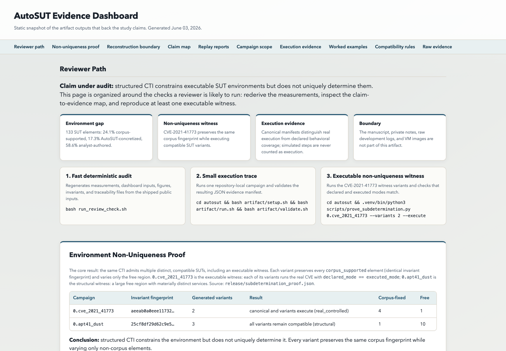

# AutoSUT Reproducibility Artifact

This anonymous repository contains the reviewer-facing artifact for
the environment-semantics measurement study. It is intentionally
venue-neutral: the repository name, files, and commands do not depend
on a specific conference track.

## Fast Reviewer Path

```bash
bash run_review_check.sh
```

The command reruns the measurement pipeline from version-pinned public input
bundles, regenerates figures and traceability outputs, and validates
numeric invariants. The study manuscript itself is intentionally
not included in this artifact; this repository is the independent
evidence and reproduction package.

Expected runtime on a laptop-class machine is about one minute once
Python and LaTeX dependencies are available. The command does not
require API keys, private data, paid services, Caldera, Docker, or VM
startup.

## Evidence Dashboard

The reviewer-facing static dashboard is
`autosut/release/dashboard/index.html`. After downloading and
extracting the ZIP, the lowest-friction local view is:

```bash
cd autosut/release/dashboard
python3 -m http.server 8765 --bind 127.0.0.1
```

Then open `http://127.0.0.1:8765/` in a browser. Opening
`index.html` directly also works after ZIP extraction.
The dashboard summarizes the claim map, replay report, canonical
execution evidence, and raw CSV/JSON anchors without requiring a
server beyond the optional local static-file command above.

Dashboard preview:



## Full Docker Replay

```bash
cd autosut
python3 scripts/run_all_orchestrated_campaigns.py --preflight-only
python3 scripts/run_all_orchestrated_campaigns.py --clean-stale-autosut-containers
```

This path replays the implemented Docker-backed campaign/SUT pairs
and writes TSV/JSON reports under `release/`. It is slower than the
fast validation path and requires Docker; the preflight separates
infrastructure readiness from campaign failures before the long run.

## Executable Non-Uniqueness Witness

```bash
cd autosut
bash artifact/setup.sh
.venv/bin/python3 scripts/prove_subdetermination.py 0.cve_2021_41773 --variants 2 --execute
```

This Docker-backed witness varies only analyst-authored SUT elements
while preserving the same corpus fingerprint and executing the real
CVE-2021-41773 mechanism in each compatible variant.

## Layout

- `autosut/`: artifact code, version-pinned bundles, release outputs, and reviewer scripts.
- `ARTIFACT_BOUNDARY.md`: what is included and intentionally excluded.
- `ARTIFACT_MANIFEST.md`: SHA-256 manifest for the staged repository.
